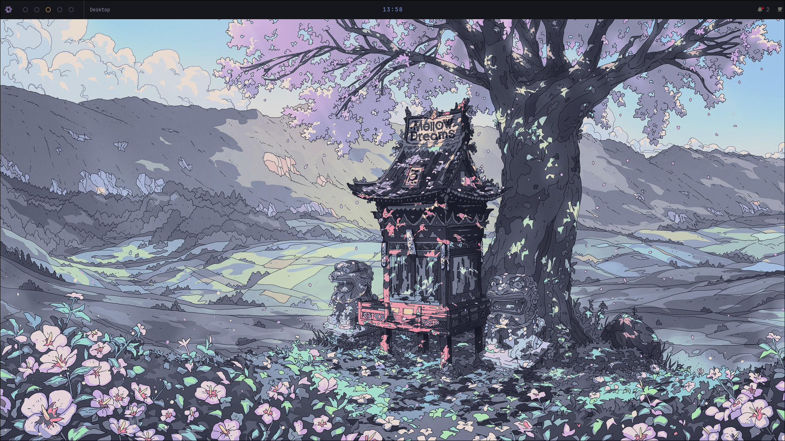
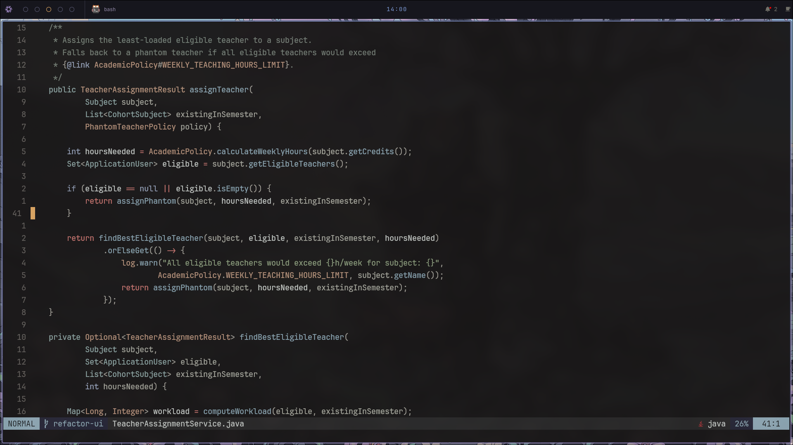

# NixOS Configuration

Personal NixOS setup using flakes and Home Manager, focused on a minimal Hyprland desktop and role-based system configuration.

---

## Screenshots

### Desktop (Hyprland + Stylix)

### Terminal

### Editor (Neovim / nixvim)

---

## Home Manager

Home Manager configuration lives under the `home/` directory.

- All home modules are imported from a single entry file
- Modules are located in `home/modules/`

### Hyprland & Dotfiles
- The system uses **Hyprland**
- Desktop ricing (bar, terminal, etc.) lives in `dotfiles/`
- These configs are imported via `home/skylark.nix`
- Dotfiles are **not written in Nix** (intentionally, for now)

### Neovim
- Neovim is configured using **nixvim**
- Chosen mainly for easier **LSP configuration**
- Located under Home Manager modules

### Theming
- **Stylix** is used for system-wide theming
- Stylix control over nixvim is **disabled**
  - Recommended if you theme nixvim manually

---

## Hosts

The `hosts/` directory contains configurations for different machines.

Each host may include:
- `boot.nix` – bootloader configuration
- `configuration.nix` – host-specific imports and roles
- `hardware-configuration.nix` – hardware-specific settings

Shared configuration is imported from:
- `hosts/common.nix`

### Roles
- Roles are reusable sets of configuration
- Examples:
  - `dev` – development setup
  - `gaming` – gaming-related configuration
- Roles are imported by each host as needed

---

### laptop

Configuration tailored for my laptop.

- Uses Fedora’s GRUB to boot NixOS
  - NixOS GRUB is disabled
- Used mainly for:
  - Development
  - Light gaming
- Imports the appropriate roles accordingly

---

### nixos

Desktop configuration and default host.

- Serves as a base for new machines
- `configuration.nix` may need to be replaced with the one generated during installation on a new system

---

## Modules

System-wide modules live under `modules/`.

They are organized into:
- `desktop/` – window manager and desktop-related config
- `services/` – system services
- `system/` – core system configuration
- `roles/` – role-based configs for specific use cases
