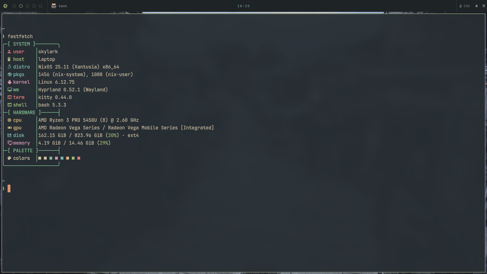
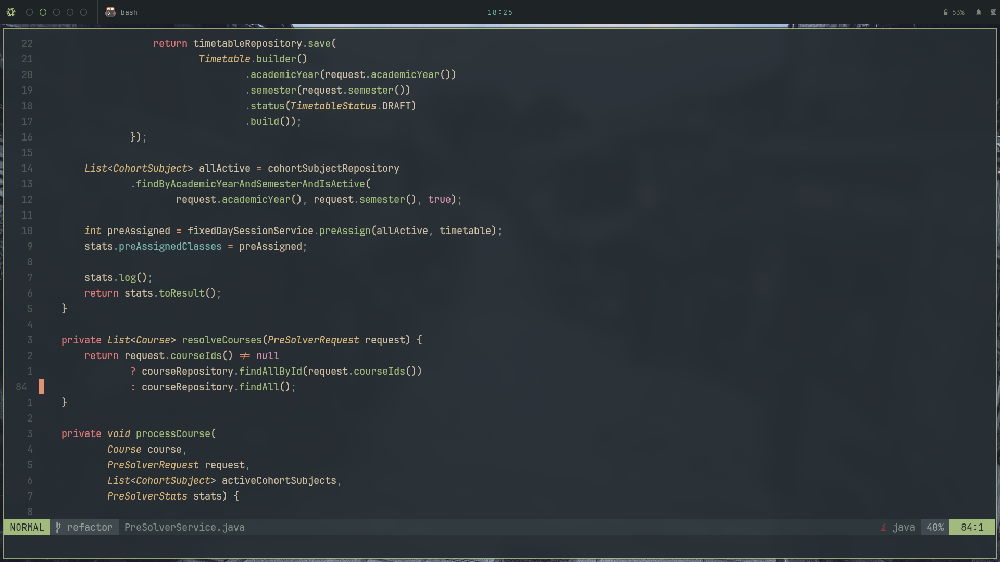

# NixOS Configuration

This repository contains a modular NixOS configuration based on Nix Flakes and Home Manager. It is designed with a role-based system architecture and a layered user environment, primarily focused on a minimal and aesthetically pleasing Hyprland desktop experience.

---

## Screenshots

### Desktop (Hyprland + Stylix)


### Terminal (Fastfetch + Starship)


### Editor (Neovim via nixvim)


---

## Architecture Overview

The configuration is built around two main principles: **Modular System Roles** and **Layered User Environments**.

### Role-Based System Configuration
NixOS system modules are organized into reusable roles located in `modules/role/`. Each host (machine) selects the roles it requires, ensuring a lean and focused installation while sharing common system settings.

### Three-Layer Home Manager Architecture
The user environment is split into three independent layers to ensure modularity and clean separation of concerns:

| Layer | Location | Description |
| :--- | :--- | :--- |
| **Layer 1: Core** | `home/skylark.nix` | Fundamental CLI tools, Git, Nixvim, Starship, and XDG directories. No GUI dependencies. |
| **Layer 2: Wayland** | `home/modules/wayland/` | Shared Wayland utilities like Kitty, Waybar, SwayNC, and Fuzzel. Compositor-agnostic. |
| **Layer 3: Compositor** | `home/modules/hyprland/` | The entry point for the desktop environment. Imports Layer 2 and defines compositor-specific logic. |
| **Layer 3: Standalone** | `home/modules/standalone/` | A standalone system agnostic module with my dev tools. |

---

## Directory Structure

```text
.
├── flake.nix             # Flake entry point and host definitions
├── hosts/                # Machine-specific configurations
│   ├── laptop/           # Laptop-specific setup (e.g., power management)
│   └── nixos/            # General desktop base configuration
├── modules/              # NixOS system-level modules
│   ├── role/             # Bundled features (gaming, dev, hyprland, etc.)
│   ├── services/         # System services (audio, ssh, power)
│   └── system/           # Core system settings (fonts, networking, nix)
├── home/                 # Home Manager configurations
│   └── modules/          # Layered user environment modules
│       ├── nixvim/       # Modular Neovim configuration
│       ├── wayland/      # Compositor-agnostic Wayland setup
│       ├── hyprland/     # Hyprland-specific modules
│       └── standalone/   # Generic desktop-agnostic tools for non-NixOS
├── dotfiles/             # External configuration files symlinked via Home Manager
└── assets/               # Screenshots and wallpapers
```

---

## Systems & Roles

### Configured Hosts
- **laptop**: Optimized for mobile use with specific power management and hardware support. Uses external GRUB.
- **nixos**: A standard desktop configuration serving as a template for new installations.

### Available Roles
- **hyprland**: Tiling window manager, greetd login manager, and GTK/Qt Wayland compatibility.
- **dev**: Development environment including Docker and essential build tools.
- **gaming**: Steam and performance optimizations for gaming.
- **bluetooth**: Bluetooth stack and Blueman for graphical management.
- **printing**: CUPS service with HP and Epson drivers, plus SANE scanning support.

---

## Key Features

### Theming with Stylix
System-wide theming is handled by **Stylix**, ensuring a consistent color scheme, font selection, and wallpaper across the entire system. Fonts are managed centrally via Stylix to avoid duplication.

### Neovim (nixvim)
The editor is configured using **nixvim**, allowing for a fully declarative Neovim setup. The configuration is modularized into `options.nix`, `keymaps.nix`, `plugins.nix`, and `lsp.nix` for better maintainability.

### Dotfile Management
While the system is managed by Nix, specific application configurations (like Hyprland scripts and Waybar styles) are kept in their native formats within the `dotfiles/` directory. These are symlinked to their respective locations using `xdg.configFile`, allowing for easier testing and portability.

---

## Installation & Usage

### Applying Configuration
To apply the configuration for a specific host:
```bash
sudo nixos-rebuild switch --flake .#<hostname>
```

### Standalone Home Manager
For non-NixOS systems (like Fedora), apply the Home Manager configuration:
```bash
home-manager switch --flake .#skylark
```

---

## Technical Notes

### Networking
Networking is managed by **NetworkManager** with **iwd** as the WiFi backend. This configuration was chosen to resolve issues encountered with standard `wpa_supplicant` and certain container/DNS configurations.

### Boot Management
- **laptop**: Designed to coexist with other operating systems. The NixOS-managed GRUB is disabled, relying on an external bootloader (e.g., Fedora's GRUB) to handle boot entries.
- **nixos**: Standard EFI boot with systemd-boot.

### Theming
**Stylix** control over **nixvim** is explicitly disabled. This allows for manual control over editor-specific color schemes and UI components while maintaining system-wide consistency for other applications.

---

## TODOs

### Lean & Mean Improvements
- [ ] **Deduplicate Packages**: Remove `gemini-cli` and `nodejs` from host-specific configs where they overlap with the `dev` role.
- [x] **Refactor Flake Outputs**: Update `mkHost` in `flake.nix` to allow per-host Home Manager module selection instead of hardcoding Hyprland.
- [x] **Dynamic User Groups**: Link `extraGroups` (like `docker`, `lpadmin`) to the activation of their respective roles/services.
- [ ] **Optimize System Layer**: Move `libnotify`, `iw`, and `usbutils` from the core system profile to more specific roles where appropriate.
