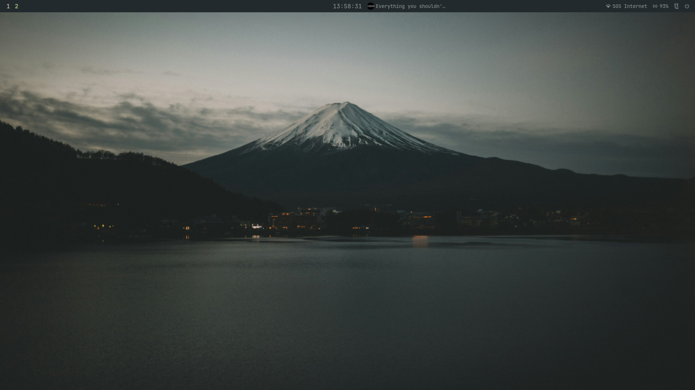
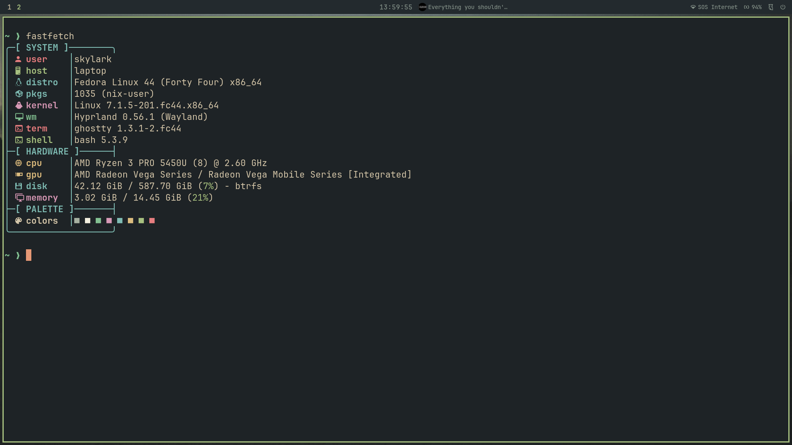
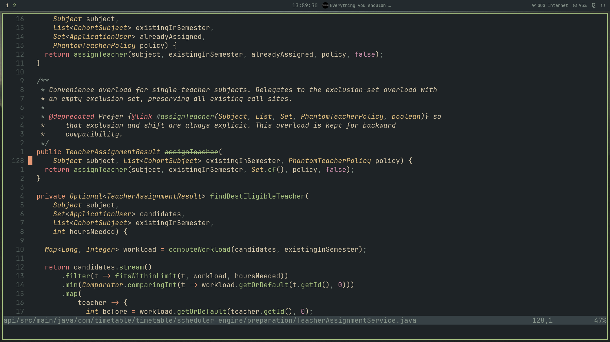

# NixOS Configuration

A modular NixOS and Home Manager configuration.

---

## Architecture

### System Roles (`modules/role/`)
Hosts select from reusable roles to ensure lean installations:
- **dev**: Docker, build tools, and essential CLI utilities.
- **gaming**: Steam, Heroic, Lutris, and performance optimizations.
- **bluetooth**: Bluetooth stack and management tools.
- **printing**: CUPS with HP/Epson drivers and SANE scanning.

### User Layers (`home/`)
Modular Home Manager environment:
- **Core**: Fundamental CLI tools, Git, Starship, and XDG directories.
- **Noctalia**: Unified Wayland shell layer — bar, notifications, launcher, and session controls in one cohesive package, replacing the old Waybar/Dunst/Fuzzel stack.
- **Compositor**: Hyprland-specific logic and scripts.
- **Nixvim**: Modular Neovim configuration via `nixvim`.
- **Standalone**: Desktop-agnostic tools for non-NixOS systems.

---

## Key Features

- **Unified Shell**: **Noctalia** consolidates the bar, notification daemon, and app launcher into a single configurable layer, cutting down on the number of moving parts compared to a Waybar/Dunst/Fuzzel setup.
- **Terminal**: **Ghostty** is the primary terminal, configured via `dotfiles/ghostty`.
- **Declarative Editor**: Neovim is configured via **nixvim**, split into logical modules (`plugins.nix`, `lsp.nix`, etc.).
- **Hybrid Configuration**: Core system state is managed by Nix, while specific application styles (Noctalia config, Hyprland scripts) are symlinked from `dotfiles/` for portability.
- **Boot Management**:
  - **laptop**: Uses `systemd-boot` with EFI variable modifications disabled to coexist with external bootloaders.
  - **nixos**: Standard `systemd-boot` with full EFI management.

---

## Directory Structure

```text
.
├── flake.nix             # Flake entry point and host definitions
├── hosts/                # Machine-specific configurations
├── modules/              # NixOS system-level modules (roles, services, system)
├── home/                 # Home Manager modules (nixvim, noctalia, standalone)
├── dotfiles/              # External configs symlinked via Home Manager (fastfetch, ghostty, hyprland, noctalia, wallpapers)
└── assets/               # Screenshots
```

---

## Installation & Usage

### NixOS
```bash
sudo nixos-rebuild switch --flake .#<hostname>
```

### Standalone Home Manager
```bash
home-manager switch --flake .#skylark
```

---

## Screenshots

### Desktop


### Terminal


### Editor


---
